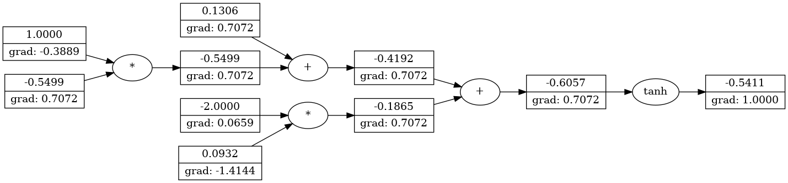
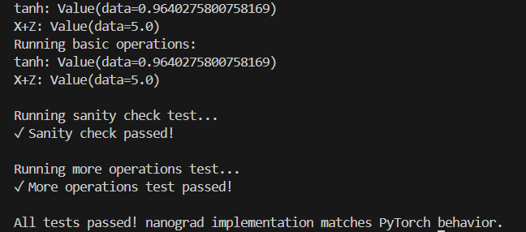
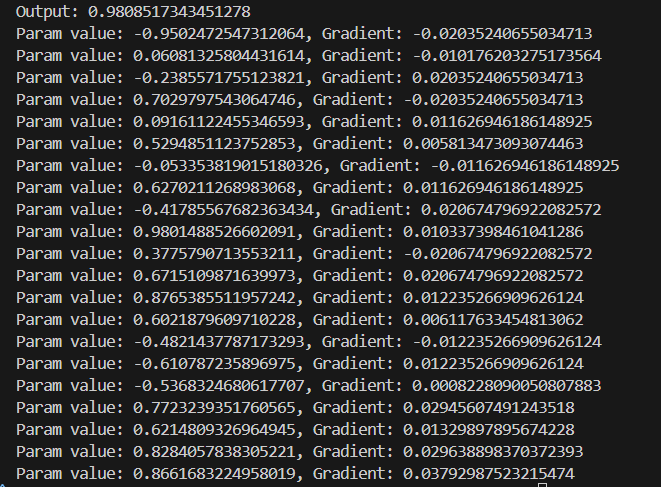

## Nanograd

A tiny autograd engine that implements backpropagation (reverse-mode autodiff) over a dynamically built computational graph. Built with [@karpathy's](https://github.com/karpathy) 
[NN-zero to hero](https://github.com/karpathy/micrograd/) series.


### Example usage

Below is a slightly contrived example showing a number of possible supported operations:

```python
from nanograd.engine import Value

a = Value(-4.0)
b = Value(2.0)
c = a + b
d = a * b + b**3
c += c + 1
c += 1 + c + (-a)
d += d * 2 + (b + a).reLU()
d += 3 * d + (b - a).reLU()
e = c - d
f = e**2
g = f / 2.0
g += 10.0 / f
print(f'{g.data:.4f}') # prints 24.7041, the outcome of this forward pass
g.backward()
print(f'{a.grad:.4f}') # prints 138.8338, i.e. the numerical value of dg/da
print(f'{b.grad:.4f}') # prints 645.5773, i.e. the numerical value of dg/db
```

### Tracing / visualization 

For added convenience, the notebook trace_graph.ipynb produces graphviz visualizations. E.g. this one below is of a simple 2D neuron, arrived at by calling draw_dot on the code below, and it shows both the data (left number in each node) and the gradient (right number in each node).

```python
from nanograd import nn
from nanograd.engine import Value
from nanograd.utils import draw_dot

n = nn.Neuron(2)
x = [Value(1.0), Value(-2.0)]
y = n(x)

y.backward()  

dot = draw_dot(y)
```


### Running Test



### Neural Network API

Nanograd includes a simple neural network library with the following components:

```python
from nanograd import nn
from nanograd.engine import Value
from nanograd.nn import Neuron, Layer, MLP

# Create a basic neuron with 3 inputs
neuron = nn.Neuron(3)

# Create a layer of 5 neurons, each taking 10 inputs
layer = nn.Layer(10, 5)

# Create a multi-layer perceptron with 3 inputs, 
# a hidden layer of 4 neurons, and 1 output neuron
mlp = nn.MLP(3, [4, 1])

# Forward pass
x = [Value(1.0), Value(0.5), Value(-1.0)]  # input
output = mlp(x)

# Print the output value
print("Output:", output.data)

# Backward pass for gradients
output.backward()

# Print gradients for each parameter in the MLP
for param in mlp.parameters():
    print(f"Param value: {param.data}, Gradient: {param.grad}")

# Zero gradients before next pass
mlp.zero_grad()
```

